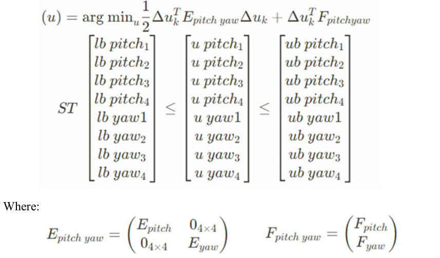

## SIMULINK MODEL OF EMBEDDED MPC CONTROLLER AND ISP SYSTEM 
###### To run qpOASES on SIMULINK, user need to dowload MATLAB Support for MinGW-w64 C/C++/Fortran Compiler. Instruction can be found in qpOASES manual document. 
###### After dowloading the COMPILER, Run file Initialize_Hessian_matrix.m and make.m before running SIMULINK model.  

#### Overall of System

   
  <i>Overall of System</i>

##### MPC block 
- The MPC block is used to solve below optimation problem at each steps where E is Hessian Matrix and F is gradient vector
- 
  

   
  <i>Optimization_problem</i>

   
  <i>MPC_block</i>

##### Kalman Estimator block
- Kalman filter block for pitch and yaw axis are designed by MATLAB function using following flow: 

   
  <i>Flow of Kalman Filter in 1 estimation window 
</i>

#### Output of Kalman estimator with disturbance

   
  <i>Output of Kalman estimator for pitch axis with disturbances 
</i>

   
  <i>Output of Kalman estimator for yaw axis with disturbances 
</i>

#### Output of system

   
  <i>Response of system with disturbance 
</i>

